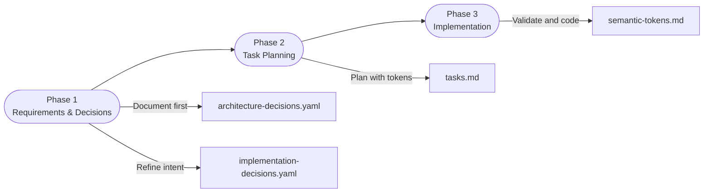
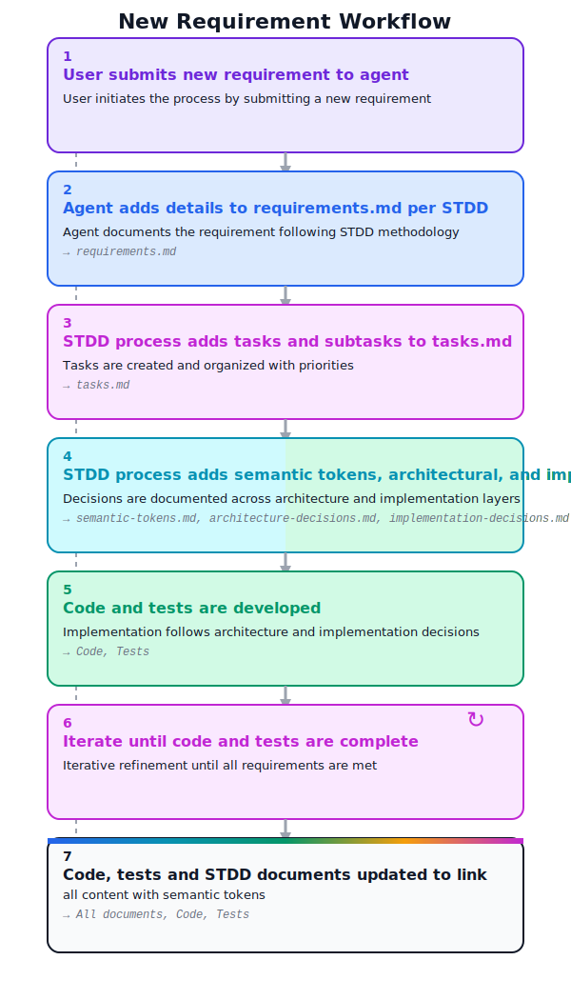
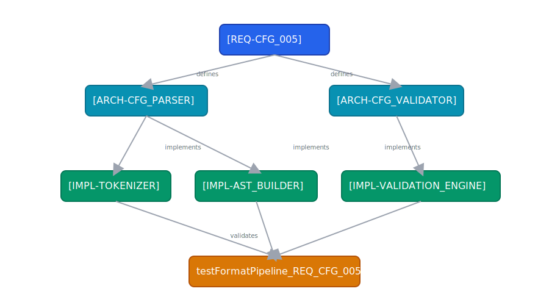
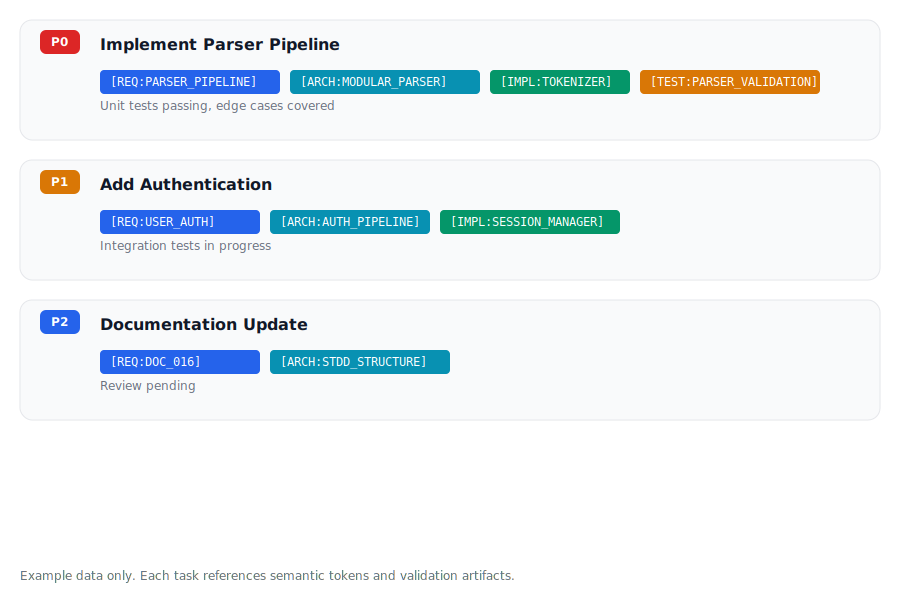

# STDD Methodology Template

**STDD Methodology Version**: 1.5.0

This repository ([https://github.com/fareedst/stdd](https://github.com/fareedst/stdd)) contains the **Semantic Token-Driven Development (STDD)** methodology template that can be used as a base for development projects in any language.

## What is STDD?

**Semantic Token-Driven Development (STDD)** uses semantic tokens to create a traceable chain from requirements through architecture and implementation to tests and code.

### Key Benefits

- **Traceability**: Every code decision can be traced back to its requirement
- **Context Preservation**: The "why" behind decisions is never lost
- **Living Documentation**: Documentation stays connected to code via tokens
- **Onboarding**: New developers can understand intent quickly
- **Refactoring Confidence**: Changes can be validated against original intent

## Getting Started with a New Project

### Step 1: Copy Templates to Your Project

**Recommended:** Download or clone the STDD repository somewhere convenient, then run `./copy_files.sh /path/to/project` (or `./copy_files.sh` if you are already in the project directory). The script copies every `.template` file into the target project's `stdd/` directory, removes the `.template` suffix for you, and will never overwrite an existing `AGENTS.md` or `.cursorrules` file that may already be present in the destination.

```bash
# From the STDD repo root—adjust the target path as needed
./copy_files.sh /path/to/your/project
```

**Alternative (manual):**

```bash
# In your project directory (after cloning/downloading the STDD repository)
mkdir -p stdd
cp requirements.template.md stdd/requirements.md
cp requirements.template.yaml stdd/requirements.yaml
mkdir -p stdd/requirements
cp requirements.template/*.md stdd/requirements/
cp architecture-decisions.template.md stdd/architecture-decisions.md
cp architecture-decisions.template.yaml stdd/architecture-decisions.yaml
mkdir -p stdd/architecture-decisions
cp architecture-decisions.template/*.md stdd/architecture-decisions/
cp implementation-decisions.template.md stdd/implementation-decisions.md
cp implementation-decisions.template.yaml stdd/implementation-decisions.yaml
mkdir -p stdd/implementation-decisions
cp implementation-decisions.template/*.md stdd/implementation-decisions/
cp processes.template.md stdd/processes.md
cp semantic-tokens.template.md stdd/semantic-tokens.md
cp tasks.template.md stdd/tasks.md
cp AGENTS.md AGENTS.md              # Copy canonical AI agent guide
cp .cursorrules .cursorrules        # Copy Cursor loader if using Cursor
```

**Important**: Each project should have its own copies of these files. The template files remain in the [STDD repository](https://github.com/fareedst/stdd) as reference templates.


## Example Workflow

1. **User Request**: "Add user authentication"
2. **AI Response (Planning Phase - NO CODE YET)**: 
   - Creates `[REQ-USER_AUTH]` token in `requirements.yaml`
   - Expands into pseudo-code and decisions
   - **IMMEDIATELY** documents architecture decisions in `architecture-decisions.yaml` with `[ARCH-*]` tokens
   - **IMMEDIATELY** documents implementation decisions in `implementation-decisions.yaml` with `[IMPL-*]` tokens
   - **IMMEDIATELY** updates `semantic-tokens.md` with all new tokens
   - **IMMEDIATELY** creates tasks in `tasks.md` with priorities and semantic token references
   - **NO code changes yet**
3. **User Approval**: User reviews and approves planning documents
4. **Implementation Phase**: 
   - Implement tasks, starting with highest priority
   - **DURING implementation**: Update documentation as decisions are made or refined
   - **DURING implementation**: Update `tasks.md` as subtasks are completed
5. **Completion Phase**: 
   - Verify all documentation is up-to-date and mirrors the semantic tokens referenced by the finished code and tests
   - Mark tasks complete in `tasks.md`
   - Remove completed subtasks
   - Ensure the semantic tokens registered in `semantic-tokens.md` match the tokens used across code, tests, and documentation for these changes

See [LLM Response Guide](llm-response-guide.md) for detailed information about how AI assistants should respond when working with STDD.

### Phase Flow Shortcut

*Mermaid flowchart showing the documentation-first cadence before code begins.*

## Repository Structure

This repository contains:

### Methodology Documentation (Reference Only)
- `STDD.md` - STDD methodology overview (for beginners, intermediate, and experts)
- `ai-principles.md` - Complete STDD principles and process guide
- `stdd-language-spec.md` - STDD language specification (pseudo-code templates with semantic tokens)
- `conversation.template.md` - Template conversation demonstrating STDD workflow
- `AGENTS.md` - Canonical AI agent operating guide
- `.cursorrules` - Cursor IDE loader that points to `AGENTS.md`
- `CHANGELOG.md` - Version history of the STDD methodology
- `VERSION` - Current methodology version

### Project Template Files (Copy to Your Project)
- `requirements.template.md` - Template guide for requirements documentation
- `requirements.template.yaml` - YAML database template for requirements with `[REQ-*]` tokens **(v1.5.0: structured fields for traceability, rationale, criteria, metadata)**
- `requirements.template/` - Individual requirement detail file examples
- `architecture-decisions.template.md` - Template guide for architecture decisions documentation
- `architecture-decisions.template.yaml` - YAML database template for architecture decisions with `[ARCH-*]` tokens **(v1.5.0: structured fields for traceability, rationale, alternatives, metadata)**
- `architecture-decisions.template/` - Individual architecture decision detail file examples
- `implementation-decisions.template.md` - Template guide for implementation decisions documentation
- `implementation-decisions.template.yaml` - YAML database template for implementation decisions with `[IMPL-*]` tokens **(v1.5.0: structured fields for traceability, rationale, code_locations, metadata)**
- `implementation-decisions.template/` - Individual implementation decision detail file examples
- `processes.template.md` - Template for process tracking including `[PROC-YAML_DB_OPERATIONS]`
- `semantic-tokens.template.md` - Template for semantic token registry
- `tasks.template.md` - Template for task tracking

## Project File Structure

After copying templates, your project should have:

```
your-project/
├── AGENTS.md                 # Canonical AI agent instructions
├── .cursorrules              # Cursor IDE loader (optional, if using Cursor)
├── stdd/
│   ├── requirements.md       # Requirements guide/documentation
│   ├── requirements.yaml     # Requirements YAML index/database with [REQ-*] records
│   ├── requirements/         # Individual requirement detail files
│   │   ├── REQ-STDD_SETUP.md
│   │   ├── REQ-MODULE_VALIDATION.md
│   │   └── ...
│   ├── architecture-decisions.md  # Architecture decisions guide/documentation
│   ├── architecture-decisions.yaml # Architecture decisions YAML index/database with [ARCH-*] records
│   ├── architecture-decisions/    # Individual architecture decision detail files
│   │   ├── ARCH-STDD_STRUCTURE.md
│   │   ├── ARCH-MODULE_VALIDATION.md
│   │   └── ...
│   ├── implementation-decisions.md # Implementation decisions guide/documentation
│   ├── implementation-decisions.yaml # Implementation decisions YAML index/database with [IMPL-*] records
│   ├── implementation-decisions/   # Individual implementation decision detail files
│   │   ├── IMPL-MODULE_VALIDATION.md
│   │   └── ...
│   ├── semantic-tokens.md    # Your project's semantic token registry
│   ├── tasks.md              # Your project's active task tracking
│   └── processes.md          # Your project's process tracking (includes [PROC-YAML_DB_OPERATIONS])
└── [your source code]        # Your actual project code
```

**Note**: The methodology documentation files (`STDD.md`, `ai-principles.md`) remain in the [STDD repository](https://github.com/fareedst/stdd) as reference. You don't need to copy them to your project unless you want local copies.

## Key Principles

### v1.5.0 Structured YAML Schema

The YAML index files use **structured, machine-parseable fields** instead of markdown-formatted strings:

- **Structured traceability**: `traceability.architecture[]`, `traceability.tests[]` - Direct list access
- **Structured rationale**: `rationale.why`, `rationale.problems_solved[]`, `rationale.benefits[]` - Organized reasoning
- **Structured criteria**: Lists of items with optional metrics/coverage for precise validation
- **Structured metadata**: Grouped `created`, `last_updated`, `last_validated` with date/author/reason/result

**Query Examples**:
```bash
# Get architecture dependencies
yq '.REQ-STDD_SETUP.traceability.architecture[]' stdd/requirements.yaml

# Get satisfaction criteria
yq '.REQ-STDD_SETUP.satisfaction_criteria[].criterion' stdd/requirements.yaml

# Get alternatives considered
yq '.ARCH-STDD_STRUCTURE.alternatives_considered[].name' stdd/architecture-decisions.yaml

# Get code file locations
yq '.IMPL-STDD_FILES.code_locations.files[].path' stdd/implementation-decisions.yaml
```

This enables **direct field access**, **structured queries**, **easy filtering**, and **better tool integration** compared to parsing markdown-formatted strings.

---

1. **Semantic Token Cross-Referencing**
   - All code, tests, requirements, architecture, and implementation decisions MUST be cross-referenced using semantic tokens

2. **Documentation-First Development**
   - Requirements MUST be expanded into pseudo-code and architectural decisions before implementation
   - No code changes until requirements are fully specified with semantic tokens

3. **Independent Module Validation Before Integration**
   - Logical modules MUST be validated independently before integration into code satisfying specific requirements
   - Each module must have clear boundaries, interfaces, and validation criteria defined before development
   - Modules must pass independent validation (unit tests with mocks, integration tests with test doubles, contract validation, edge case testing, error handling validation) before integration
   - Integration only occurs after module validation passes
   - **Rationale**: Eliminates bugs related to code complexity by ensuring each module works correctly in isolation before combining with other modules

4. **Test-Driven Documentation**
   - Tests MUST reference the requirements they validate using semantic tokens
   - Test names should include semantic tokens

5. **Incremental Task Tracking**
   - Every requirement implementation MUST be broken down into trackable tasks
   - Tasks have explicit priorities: P0 > P1 > P2 > P3

6. **Complete Task Completion**
   - When all subtasks for a task are complete, remove subtasks and mark the parent task complete
   - Maintain a clean task list showing only active work

## Visual Guides

### New Requirement Timeline


### Traceability Graph

*Sample graph illustrating how requirements branch to architecture and implementation tokens before hitting validation tests.*

### Task & Token Alignment


| Task | Priority | Token Trail | Validation Evidence
| --- | --- | --- | ---
| Implement Parser Pipeline `[REQ-CFG_005]` | P0 | `[ARCH-FORMAT_PIPELINE] → [IMPL-PLACEHOLDER_ENGINE]` | Token audit + formatter unit test bundle
| Validate Formatter Module | P1 | `[ARCH-MODULE_VALIDATION] → [IMPL-VALIDATION_SUITE]` | Contract test suite + `[PROC-TOKEN_VALIDATION]` run
| Update Docs for New Feature | P2 | `[REQ-STDD_SETUP] → [ARCH-STDD_STRUCTURE] → [IMPL-STDD_FILES]` | Documentation review checklist

*Hypothetical task descriptions showing how `tasks.md` should carry semantic tokens and validation artifacts.*


## Language-Specific Notes

The STDD methodology is language-agnostic. When customizing templates for your project:

- **Language‑specific projects**: Update code examples in templates to match your chosen language
- **Other languages**: Adapt the templates to your language's conventions

The semantic token system and development process remain the same regardless of language.

## Resources

### Methodology Documentation (Reference)
- `STDD.md` - STDD methodology overview (for beginners, intermediate, and experts)
- `ai-principles.md` - Complete STDD principles and process guide
- `stdd-language-spec.md` - STDD language specification (pseudo-code templates with semantic tokens)
- `conversation.template.md` - Template conversation demonstrating STDD workflow
- `CHANGELOG.md` - Version history

### Template Files (Copy to Your Project)
- `requirements.template.md` - Template guide for requirements documentation
- `requirements.template.yaml` - YAML database template for requirements with `[REQ-*]` tokens **(v1.5.0: structured fields)**
- `requirements.template/` - Individual requirement detail file examples
- `architecture-decisions.template.md` - Template guide for architecture decisions documentation
- `architecture-decisions.template.yaml` - YAML database template for architecture decisions with `[ARCH-*]` tokens **(v1.5.0: structured fields)**
- `architecture-decisions.template/` - Individual architecture decision detail file examples
- `implementation-decisions.template.md` - Template guide for implementation decisions documentation
- `implementation-decisions.template.yaml` - YAML database template for implementation decisions with `[IMPL-*]` tokens **(v1.5.0: structured fields)**
- `implementation-decisions.template/` - Individual implementation decision detail file examples
- `processes.template.md` - Template for process tracking including `[PROC-YAML_DB_OPERATIONS]`
- `semantic-tokens.template.md` - Template for semantic token registry
- `tasks.template.md` - Template for task tracking
- `AGENTS.md` - Canonical AI agent operating guide (copy as-is)
- `.cursorrules` - Template for Cursor IDE loader (optional)

## Repository

**STDD Methodology Repository**: [https://github.com/fareedst/stdd](https://github.com/fareedst/stdd)

# License

The document is available as open source under the terms of the [MIT License](https://opensource.org/licenses/MIT).
